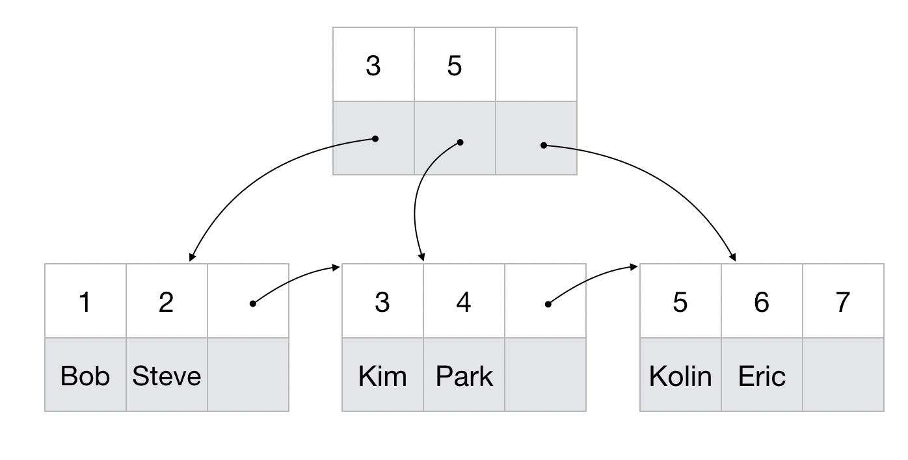

# On-Disk B+ Tree

Database 내부 Record Mangement system을 위한 On-disk B+ Tree 소개 및 In-Memory 구현체 분석.

## 1. What is B+ Tree

Tree형 자료구조의 일종으로 정렬된 Key-Value Pair에 대한 효율적인 삽입, 검색, 삭제를 지원한다.

각각의 노드는 최대 노드 갯수 B를 기준으로 루트 노드를 제외, {B - 1}개의 키와 B개의 자식 노드를 가질 수 있다. Pair의 수에 따라 다계층으로 구성되며, 계층의 수와 검색에 소요되는 시간이 비례한다. 이에 계층 수를 tight하게 관리하기 위해 추가적인 Balancing policy를 보유하고 있다. 

## 2. Why it used as on-disk data structure

B+ Tree는 B라는 Branching Factor를 Hyperparameter로 가지고 있는데, 이 크기가 늘어날 수록 하나의 노드에서 키를 찾는데 시간이 상대적으로 증가하지만, 디스크 접근 속도가 월등히 느린 현대 컴퓨터에서는 B를 키워 노드를 읽는 수를 줄일 수 있다는 장점을 가진다.

하나의 노드 내에서 키를 검색하는데에는 선형 탐색을 가정할 때 B번, 2진 탐색을 가정할 때 logB의 시간 복잡도를 가진다.

N개의 데이터를 가정할 때, 자료 구조에서 요구하는 노드의 수와 트리의 높이는 다음과 같다.

기존의 BST나 AVL 트리가 B=2를 기준으로 했다면, B+ Tree (혹 B Tree)는 이를 보다 일반화 하여 노드를 불러오는 횟수를 줄인 자료구조이다. 디스크에서 노드를 불러온 후, 키를 검색하는 알고리즘은 In-Memory로 작동하기 때문에 기존의 트리형 자료구조에 비해 빠른 검색을 지원한다.

## 3. Balancing policy

## 4. Insertion method in bpt.c

## 5. Deletion method in bpt.c

## 6. Merge and split operations in bpt.c

## 7. Naive Design requirements for on-disk b+ tree
